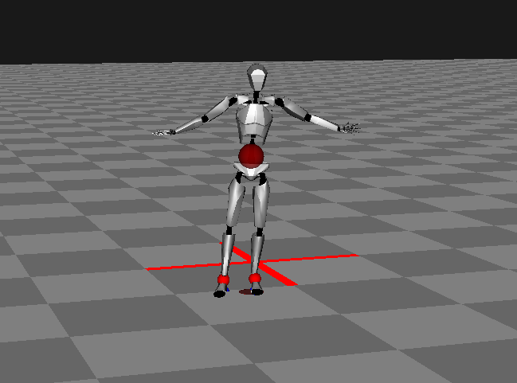
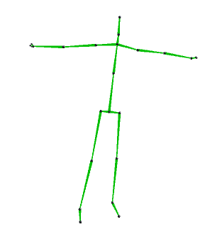
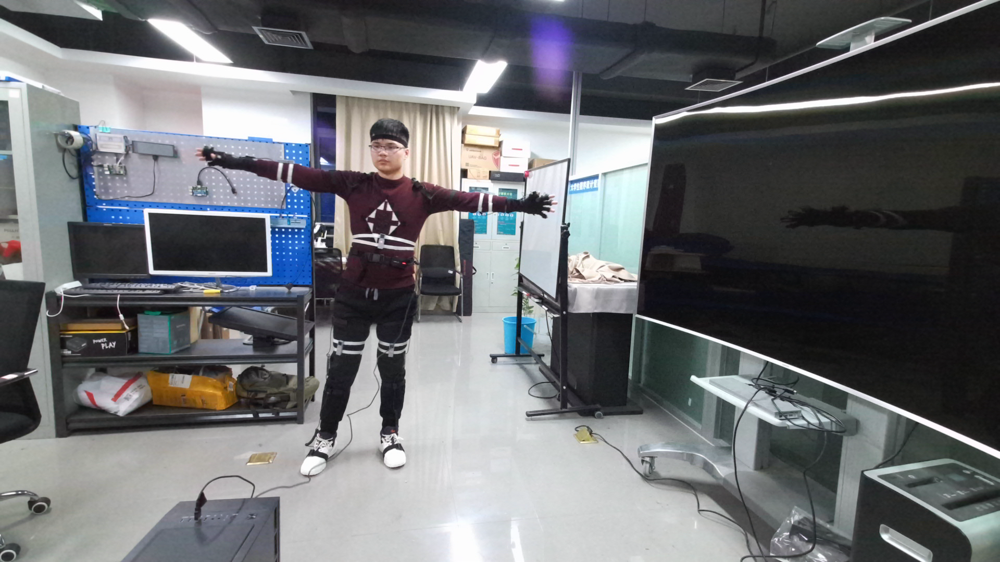
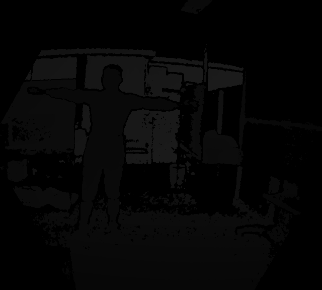
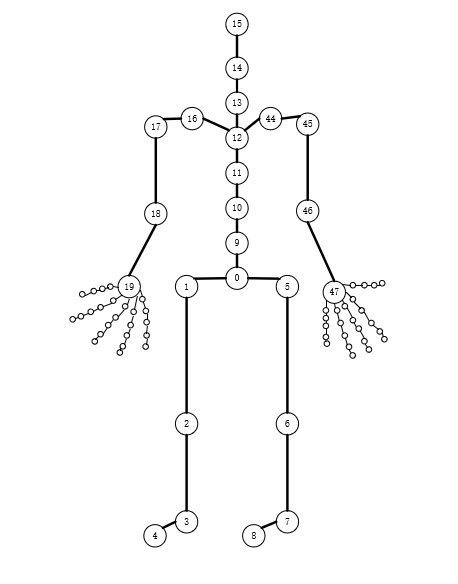
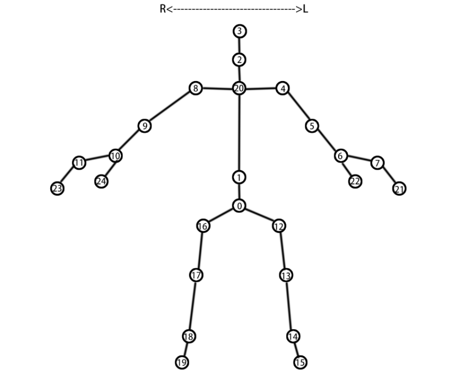
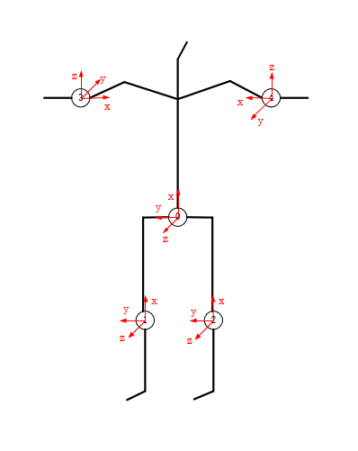

# HFUT-MMD
包含动作捕捉运动数据、Kinect骨骼位置运动数据、可见光图像、深度图像、五个IMU的全身运动数据，数据做过时空同步操作

相关文献：程景铭,谢文军,沈子祺,李琳,刘晓平.[多模态人体运动同步数据集](https://www.jcad.cn/jcadcms/show.action?code=publish_402880124b362464014b3c4d819803a1&newsid=9239a02bc73f4cbcb116747a47d7670e)[J].计算机辅助设计与图形学学报,2022,34(11):1713-1722.

**数据展示：**

动捕展示：

Kinect运动数据展示：

RGB图像展示：

深度图像展示：

动捕节点图：

Kinect节点图：

IMU佩戴位置：

